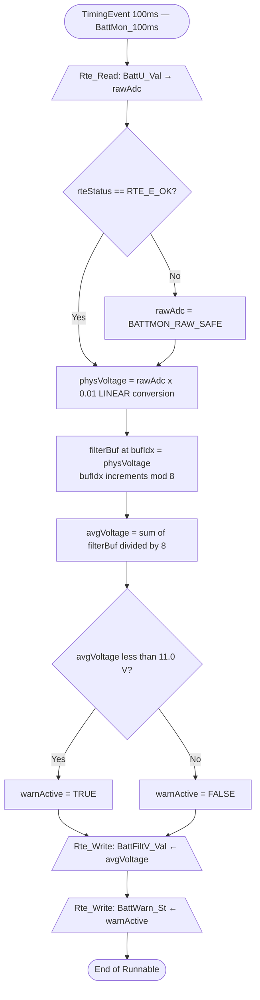
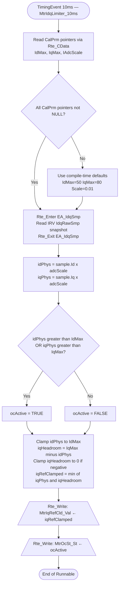

# AUTOSAR MUD Skill — APPENDIX (Reference Only)

## Table of Contents

- [§A1 — AUTOSAR Concepts Reference](#a1)
- [§A2 — Naming Keyword Cheat Sheet](#a2)
- [§A3 — Data Type Deep Dive](#a3)
- [§A4 — ISO 26262 / ASIL Safety Checklist](#a4)
- [§A5 — Anti-Patterns Reference](#a5)
- [§A6 — Worked Example 1: BatteryMonitor](#a6)
- [§A7 — Worked Example 2: MtrIdqLimiter (Multi-Rate, ASIL-B)](#a7)
- [§A8 — RTE API Quick Reference](#a8)

---

<a name="a1"></a>
## §A1 — AUTOSAR Concepts Reference

### A1.1 Software Component Types

| Type | Description | When to Use |
|------|-------------|------------|
| `AtomicSwComponentType` | Contains runnables, internal behavior, and state | Most application SWCs |
| `SensorActuatorSwComponentType` | Directly accesses hardware | Sensor read / actuator write SWCs |
| `CompositionSwComponentType` | Structural container; no runnables inside | System-level decomposition only |
| `ServiceSwComponentType` | BSW services (NvM, Dem, Com, etc.) | Do not design internals here |
| `ParameterSwComponentType` | Provides CalPrm to application SWCs | Calibration data holders |

### A1.2 Port and Interface Summary

| Port Kind | Tag | Interface Type | RTE API Family | Typical Use |
|-----------|-----|----------------|---------------|------------|
| Provider Port | P-Port | SenderReceiverInterface | `Rte_Write` / `Rte_IWrite` | Provides data to other SWCs |
| Require Port | R-Port | SenderReceiverInterface | `Rte_Read` / `Rte_IRead` | Reads data from other SWCs |
| Bidirectional | PR-Port | SenderReceiverInterface | Both read and write | Feedback loops |
| Provider Port | P-Port | ClientServerInterface | `OperationInvokedEvent` | Exposes an operation |
| Require Port | R-Port | ClientServerInterface | `Rte_Call` | Calls server operation |
| Require Port | R-Port | ParameterInterface | `Rte_CData` | Reads calibration parameter |
| Require/Provide | R/P-Port | NvDataInterface | `Rte_Read` / `Rte_Write` | NvM persistent data |
| Require Port | R-Port | ModeSwitchInterface | `Rte_Mode` | Queries active system mode |

### A1.3 Communication Paradigms

**Explicit Communication** — data transferred at the exact moment of RTE call.
- API: `Rte_Read_<RPort>_<DataElem>(&var)` / `Rte_Write_<PPort>_<DataElem>(&var)`
- Data is fresh at the exact call point.
- Use for: event-triggered runnables, server runnables, conditional reads.
- Concurrency note: manual consistency management needed.

**Implicit Communication** — RTE copies all port data at runnable entry/exit.
- API: `Rte_IRead_<Runnable>_<RPort>_<DataElem>()` / `Rte_IWrite_<Runnable>_<PPort>_<DataElem>(&var)`
- RTE guarantees a consistent snapshot for the entire runnable execution.
- Use for: cyclic runnables with a fixed, known I/O set.

> **Decision rule:** Default to Explicit unless the requirement says "consistent snapshot" or the runnable is purely cyclic with no conditional port access.

### A1.4 Runnable Entities and RTE Events

| RTE Event | Trigger | Add Runnable When... |
|-----------|---------|---------------------|
| `InitEvent` | ECU startup | Component has static state, NvM reads, or CalPrm |
| `TimingEvent` | Fixed period | Periodic monitoring, control, filtering |
| `DataReceivedEvent` | New data on R-Port | Event-driven processing on arrival |
| `DataReceiveErrorEvent` | Timeout / data loss | Fault detection, degradation mode |
| `OperationInvokedEvent` | Client calls C-S P-Port | Server operation implementation |
| `ModeSwitchEvent` | Mode transition | Mode entry / exit reactions |
| `BackgroundEvent` | Idle | Low-priority background tasks |

### A1.5 ExclusiveArea and InterRunnableVariable

**ExclusiveArea:**
- Protects shared data between runnables of the SAME SWC that may preempt each other.
- Declare in `InternalBehavior`; generated as `Rte_Enter_<AreaName>()` / `Rte_Exit_<AreaName>()`.
- Keep as short as possible — only the read-modify-write section.
- Needed when: two runnables in different OS tasks share a static variable or IRV.

**InterRunnableVariable (IRV):**
- Typed variable that passes data between runnables within the same SWC.
- Access: `Rte_IrvRead_<Runnable>_<IrvName>()` / `Rte_IrvWrite_<Runnable>_<IrvName>(&val)`
- If runnables are in different OS tasks → ALWAYS wrap IRV access in ExclusiveArea.
- IRV is NOT an S/R port — it is internal to the SWC.

---

<a name="a2"></a>
## §A2 — Naming Keyword Cheat Sheet (AUTOSAR Appendix A Subset)

### ShortName Composition Rules Recap
1. camelCase, letters+digits only, no underscores between keywords.
2. Start with uppercase letter.
3. Semantic order: `[Environment-Mean-Device][Action-PhysicalType][Condition-Qualifier][Index][ForPreposition][FieldBlock2]`
4. Sequence number suffix for evolvable elements: `BattU1`, `EngN2`.

### Keyword Abbreviations

| Full Term | Abbreviation | Full Term | Abbreviation |
|-----------|-------------|-----------|-------------|
| Acceleration | `Accr` | Limitation | `Linn` |
| Active | `Actv` | Maximum | `Max` |
| Actuator | `Actr` | Minimum | `Min` |
| Average | `Avg` | Mode | `Mod` |
| Battery | `Batt` | Motor | `Mtr` |
| Calibration | `Cal` | Number / Speed | `N` |
| Calculated | `Calc` | Output | `Out` |
| Clamped | `Cld` | Parameter | `Prm` |
| Command | `Cmd` | Pedal | `Pedl` |
| Control | `Ctrl` | Position | `Pos` |
| Converter | `Convtr` | Power | `Pwr` |
| Counter | `Ctr` | Pressure | `P` |
| Current (ampere) | `I` | Raw | `Raw` |
| d-axis | `Id` (motor context) | Reference | `Ref` |
| Diagnostic | `Diag` | Request | `Req` |
| Driver | `Drvr` | Sample | `Smp` |
| Duty Cycle | `DutyCyc` | Sensor | `Sns` |
| Enable | `En` | Speed | `N` |
| Engine | `Eng` | State / Status | `St` |
| Error | `Err` | Temperature | `T` |
| Feedback | `Fbk` | Threshold | `Thd` |
| Filter | `Filt` | Time | `Ti` |
| Flag | `Flg` | Torque | `Tq` |
| Frequency | `Freq` | Value (generic scalar) | `Val` |
| Identification | `Id` (general) | Voltage | `U` |
| Index | `Idx` | Warning | `Warn` |
| Input | `In` | Weight | `W` |
| Integrator | `Intgtr` | Wheel | `Whl` |
| q-axis | `Iq` (motor context) | — | — |

### Element Naming Examples

| Concept | shortName | longName |
|---------|-----------|---------|
| Engine speed | `EngN` | `Engine speed` |
| Battery voltage | `BattU` | `Battery voltage` |
| Filtered battery voltage | `BattFiltV` | `Battery filtered voltage` |
| Battery voltage warning status | `BattWarnSt` | `Battery voltage warning status` |
| Motor q-axis current reference | `MtrIqRef` | `Motor q-axis current reference` |
| Motor overcurrent status | `MtrOcSt` | `Motor overcurrent status` |
| Driver torque request | `DrvrTqReq` | `Driver torque request` |
| Torque limitation request for pedal implausibility | `TqLinnReqForPedlImp1` | `Torque limitation request for pedal implausibility` |

### Element-Specific Naming Rules Table

| AUTOSAR Element | Rule |
|----------------|------|
| `SwComponentType` | Noun compound, no domain prefix, no underscore, camelCase |
| `PortPrototype` | Reflects role relative to THIS component |
| `SenderReceiverInterface` | Independent of usage context; ends with sequence number |
| `VariableDataPrototype` | `Val` if generic scalar; otherwise descriptive (`St`, `Req`, `Fbk`) |
| `ApplicationDataType` | Reflects physical meaning; ends with sequence number |
| `CompuMethod` | `{Unit}Identcl` (IDENTICAL), `{Unit}Lnrl` (LINEAR), `{TypeName}` (TEXTTABLE) |
| `Unit` | SI units: `V`, `A`, `Nm`, `rpm`; derived: `Sqd`, `Per`, `ToPwrOfN` |
| `PhysicalDimension` | Torque: `Len2M1TiNeg2`; Energy: `Len2M1TiNeg2_1` |
| `ExclusiveArea` | `EA_<ProtectedResource>` |
| `InterRunnableVariable` | Descriptive noun, camelCase |
| Runnable | `<SwcName>_<NNNms>` or `<SwcName>_Init` or `<SwcName>_On<PortEvent>` |

---

<a name="a3"></a>
## §A3 — Data Type Deep Dive

### A3.1 Type Hierarchy

```
ApplicationDataType  ←── physical meaning, unit, CompuMethod, DataConstr
       │
       └── mapped via typeEmitter to:
ImplementationDataType  ←── C type, bit size, sign, endianness
```

### A3.2 Common Application → Implementation Mappings

| Physical Quantity | ApplicationDataType | CompuMethod | ImplementationDataType | Range |
|------------------|--------------------|-----------  |----------------------|-------|
| Voltage (0–65.535 V) | `U1` | LINEAR: 0.001 V/LSB | `uint16` | 0–65535 |
| Battery voltage (0–25.5 V) | `BattU1` | LINEAR: 0.1 V/LSB | `uint8` | 0–255 |
| Engine speed (0–8000 rpm) | `EngN1` | LINEAR: 0.125 rpm/LSB | `uint16` | 0–65535 |
| Torque (−1000–+1000 Nm) | `TqNm1` | LINEAR: 0.1 Nm/LSB, offset −1000 | `sint16` | −32768–+32767 |
| Temperature (−40–+215 °C) | `T1` | LINEAR: 1 °C/LSB, offset −40 | `uint8` | 0–255 |
| Boolean status | `Sts1` | TEXTTABLE: 0=FALSE, 1=TRUE | `boolean` | — |
| Enumerated mode | `OpMod1` | TEXTTABLE: 0=Init, 1=Normal… | `uint8` | 0–N |
| Motor current (−400–+400 A) | `MtrI1` | LINEAR: 0.01 A/LSB | `sint16` | — |

### A3.3 CompuMethod Syntax Notes

**LINEAR:**
```
physicalValue = (numerator / denominator) × rawValue + offset
```
Named `{Unit}Lnrl` e.g., `VLnrl`, `NmLnrl`

**IDENTICAL:**
```
physicalValue = rawValue (same unit, no conversion)
```
Named `{Unit}Identcl` e.g., `VIdentcl`

**TEXTTABLE:**
Maps integer values to symbolic names.
Named after the data type: `WarnSt1`, `OpMod1`.

### A3.4 DataConstr (Value Constraints)
- `lowerLimit`: minimum valid physical value
- `upperLimit`: maximum valid physical value
- Values outside constraints → RTE reports `RTE_E_INVALID` or tool generates range check code.

---

<a name="a4"></a>
## §A4 — ISO 26262 / ASIL Safety Checklist

Apply when the SWC is ASIL-A or higher.

| # | Check | Action |
|---|-------|--------|
| 1 | **All Rte_Read returns checked** | Store in `Std_ReturnType`; handle `!= RTE_E_OK` with safe default |
| 2 | **Safe defaults defined for every input** | Use compile-time `#define`, not magic numbers inline |
| 3 | **Range validation on all inputs** | Check against `DataConstr` min/max before use |
| 4 | **No unprotected shared static state** | Use ExclusiveArea for every cross-task static variable |
| 5 | **No division by zero** | Guard all divisions: `if (denom != 0.0f)` |
| 6 | **No unbounded loops** | All loop bounds must be compile-time constants |
| 7 | **No recursion** | AUTOSAR runnables must not call themselves |
| 8 | **No dynamic memory** | No `malloc`, `free`, `new`, `delete` — static allocation only |
| 9 | **Pointer null checks** | Use `NULL_PTR` from Platform_Types; check before dereference |
| 10 | **CalPrm pointer immediate dereference** | `val = *Rte_CData_...()` — never store pointer across calls |
| 11 | **MISRA-C:2012 target** | No implicit type conversions; explicit casts with `(type)` |
| 12 | **DEM reporting for HW faults** | `Rte_Call_R_Dem_SetEventStatus(event, DEM_EVENT_STATUS_FAILED)` |
| 13 | **Init runnable present** | Every stateful ASIL SWC must have an `InitEvent` runnable |
| 14 | **No dead code** | Every `if` / `else` branch must be exercisable |
| 15 | **NaN / Inf guard for float** | Initialize all `float32` to 0.0f; check result validity |
| 16 | **ASIL decomposition ≥ C** | Split into two independent SWCs (ASIL-B + ASIL-B) |

---

<a name="a5"></a>
## §A5 — Anti-Patterns Reference

| Anti-Pattern | Problem | Correct Approach |
|-------------|---------|-----------------|
| Ignoring `Rte_Read` return | Silently uses stale/invalid/never-received data | Always check `rteStatus != RTE_E_OK` |
| `Rte_Write` return value silently discarded with no comment | Unclear intent | Either `(void)Rte_Write(...)` with comment, or check and log |
| Storing CalPrm pointer | Pointer may be invalidated after online calibration | Dereference immediately; store value, not pointer |
| Cross-task IRV without ExclusiveArea | Race condition, data corruption | Always protect IRV with `Rte_Enter/Exit_<EA>` if runnables in different tasks |
| Unique interface per SWC | Interface proliferation, violates TR_SWMG_00011 | One interface per data concept; reuse across SWCs |
| `t_MyType` or `swc_Batt` naming | Violates TR_SWNR_00056 and TR_SWNR_00007 | `BattU1`, no kind-indicator prefix |
| Underscores in shortName between keywords | Violates TR_SWNR_00009 | camelCase: `EngNReq` not `Eng_N_Req` |
| float division without guard | NaN propagation if divisor is zero | `if (denominator != 0.0f) { result = num / denominator; }` |
| Recursive runnables | Forbidden in AUTOSAR and MISRA-C | Restructure as state machine with static state variable |
| `malloc` / dynamic allocation | Forbidden in automotive embedded AUTOSAR | Fixed-size static arrays; buffers sized at compile time |
| Multiple `Rte_Read` calls for same element in one runnable | Possible data inconsistency between reads | Read once to local variable; use local variable throughout |
| Init runnable missing when static state present | State may be garbage on startup | Always add `InitEvent` runnable that initializes all static vars |

---

<a name="a6"></a>
## §A6 — Worked Example 1: BatteryMonitor (PAT_FILTER)

### Requirement
Create a software component `BatteryMonitor` that reads battery voltage from a sensor port, applies a moving average filter over 8 samples, and provides the filtered voltage as a float. It also provides a boolean warning flag if filtered voltage drops below 11.0 V. Runnable triggered every 100 ms.

### Ambiguity Resolution (STEP 0)
- K1: ✅ Monitor battery voltage
- K2: ✅ Reads battery voltage from sensor
- K3: ✅ Provides filtered voltage + warning flag
- K4: ✅ Every 100 ms
- K5: Partial — voltage unit mentioned (V), threshold given. Raw type not stated → **[ASSUMPTION: raw input is uint16 ADC counts, LINEAR 0.01 V/LSB]**

### Pattern Selected (STEP 1)
**PAT_FILTER** — "filter", "moving average" keywords present.

### Derived AUTOSAR Model (STEP 3)

**Component:** `BattMon` (`AtomicSwComponentType`)  
Long name: *Battery monitor*

#### Port Table
| Port ShortName | Direction | Interface | Data Elem | Impl. Type | Notes |
|---------------|-----------|-----------|----------|-----------|-------|
| `BattU` | R-Port | `BattU1` (S/R) | `Val` | `uint16` | LINEAR: 0.01 V/LSB |
| `BattFiltV` | P-Port | `BattFiltV1` (S/R) | `Val` | `float32` | Physical V |
| `BattWarn` | P-Port | `BattWarn1` (S/R) | `St` | `boolean` | TRUE = undervoltage |

#### Runnable Table
| Runnable | RTE Event | Cycle | Reads | Writes |
|----------|-----------|-------|-------|--------|
| `BattMon_100ms` | TimingEvent | 100 ms | `BattU` | `BattFiltV`, `BattWarn` |

#### Assumptions Made
- [ASSUMPTION: Raw input is uint16 ADC, LINEAR 0.01 V/LSB. Correct if sensor uses different resolution.]
- [ASSUMPTION: FILTER_SIZE = 8. Increase for smoother response at cost of lag.]
- [ASSUMPTION: Safety level QM. Add range checks and DEM reporting if ASIL required.]

### Pseudocode (STEP 4)

```c
/**
 * @brief   Runnable: BattMon_100ms
 * @trigger TimingEvent, period = 100 ms
 * @swc     BattMon (AtomicSwComponentType)
 * @ports   R: BattU (BattU1, S/R, Explicit)
 *          P: BattFiltV (BattFiltV1, S/R, Explicit)
 *          P: BattWarn  (BattWarn1, S/R, Explicit)
 * @safety  QM
 */

#define BATTMON_FILTER_SIZE     (8U)
#define BATTMON_CONV_FACTOR     (0.01f)   /* V/LSB — CompuMethod BattULnrl */
#define BATTMON_WARN_THRESHOLD  (11.0f)   /* V */
#define BATTMON_RAW_SAFE        (0U)      /* Safe default: 0 V on read failure */

void BattMon_100ms(void)
{
    /* ── 1. Local Variables ──────────────────────────────────── */
    Std_ReturnType  rteStatus;
    uint16          rawAdc;
    float32         physVoltage;
    static float32  filterBuf[BATTMON_FILTER_SIZE] = {0.0f};
    static uint8    bufIdx = 0U;
    float32         avgVoltage = 0.0f;
    boolean         warnActive;
    uint8           i;

    /* ── 2. Read Raw Battery Voltage ─────────────────────────── */
    rteStatus = Rte_Read_BattU_Val(&rawAdc);
    if (rteStatus != RTE_E_OK)
    {
        rawAdc = BATTMON_RAW_SAFE; /* [ASSUMPTION: safe default = 0 on read failure] */
    }

    /* ── 3. Physical Conversion (CompuMethod LINEAR: 0.01 V/LSB) */
    physVoltage = (float32)rawAdc * BATTMON_CONV_FACTOR;

    /* ── 4. Moving Average Filter ────────────────────────────── */
    filterBuf[bufIdx] = physVoltage;
    bufIdx = (uint8)((bufIdx + 1U) % BATTMON_FILTER_SIZE);

    for (i = 0U; i < BATTMON_FILTER_SIZE; i++)
    {
        avgVoltage += filterBuf[i];
    }
    avgVoltage /= (float32)BATTMON_FILTER_SIZE;

    /* ── 5. Undervoltage Warning Logic ───────────────────────── */
    warnActive = (avgVoltage < BATTMON_WARN_THRESHOLD) ? TRUE : FALSE;

    /* ── 6. Write Outputs ────────────────────────────────────── */
    (void)Rte_Write_BattFiltV_Val(&avgVoltage);
    (void)Rte_Write_BattWarn_St(&warnActive);
}
```

### Flowchart (STEP 5)



### Self-Check (STEP 6)

| # | Check | Result | Note |
|---|-------|--------|------|
| 1 | All SLOT markers replaced | ✅ | None remaining |
| 2 | SwcName: camelCase noun, no prefix | ✅ | `BattMon` |
| 3 | Interface names end with sequence number | ✅ | `BattU1`, `BattFiltV1`, `BattWarn1` |
| 4 | Every Rte_Read return checked | ✅ | `rteStatus` checked on line 2 |
| 5 | Safe default on error path | ✅ | `BATTMON_RAW_SAFE = 0U` |
| 6 | All `#define` constants present | ✅ | 4 defines at top |
| 7 | Static variables declared static | ✅ | `filterBuf`, `bufIdx` |
| 8 | Mermaid: no spaces in node IDs | ✅ | All IDs clean |
| 9 | Mermaid: all diamonds have 2 labelled edges | ✅ | `ChkRte` and `WarnCheck` |
| 10 | All assumptions listed | ✅ | 3 assumptions documented |

**Overall: PASS — all ✅**

---

<a name="a7"></a>
## §A7 — Worked Example 2: MtrIdqLimiter (PAT_MULTI_RATE, ASIL-B)

### Requirement
Create a software component `MtrIdqLimiter` for a PMSM FOC controller on AURIX TC37x. It samples d-axis and q-axis motor currents at 1 ms, then every 10 ms applies calibratable current limits (`IdMax`, `IqMax`), computes available q-axis headroom, clamps the q-axis reference output, and provides an overcurrent status flag. Safety level: ASIL-B.

### Ambiguity Resolution (STEP 0)
All 5 Key Facts present. No defaults needed.

### Pattern Selected (STEP 1)
**PAT_MULTI_RATE** — "1 ms sample + 10 ms process" = two explicit cycle times.

### Derived AUTOSAR Model (STEP 3)

**Component:** `MtrIdqLimiter` (`AtomicSwComponentType`)  
Long name: *Motor d-q axis current limiter*

#### Port Table
| Port | Direction | Interface | Data Elem | Impl. Type | Notes |
|------|-----------|-----------|----------|-----------|-------|
| `MtrIdRaw` | R-Port | `MtrIdRaw1` (S/R) | `Val` | `sint16` | ADC counts |
| `MtrIqRaw` | R-Port | `MtrIqRaw1` (S/R) | `Val` | `sint16` | ADC counts |
| `MtrIdqLimPrm` | R-Port | `MtrIdqLimPrm1` (Param) | `IdMax`, `IqMax`, `IAdcScale` | `float32` | CalPrm |
| `MtrIqRefCld` | P-Port | `MtrIqRef1` (S/R) | `Val` | `float32` | A — clamped Iq ref |
| `MtrOcSt` | P-Port | `MtrOcSt1` (S/R) | `St` | `boolean` | TRUE = overcurrent |

#### Runnable Table
| Runnable | Event | Cycle | Reads | Writes |
|----------|-------|-------|-------|--------|
| `MtrIdqLimiter_Init` | InitEvent | once | `MtrIdqLimPrm` | IRV: `IdqRawSmp` |
| `MtrIdqLimiter_1ms` | TimingEvent | 1 ms | `MtrIdRaw`, `MtrIqRaw` | IRV: `IdqRawSmp` |
| `MtrIdqLimiter_10ms` | TimingEvent | 10 ms | IRV: `IdqRawSmp`, CalPrm | `MtrIqRefCld`, `MtrOcSt` |

#### IRV and ExclusiveArea
| Name | Type | Between | Protection |
|------|------|---------|-----------|
| `IdqRawSmp` | `MtrIdqRaw1` (struct: `Id: sint16`, `Iq: sint16`) | `MtrIdqLimiter_1ms` ↔ `MtrIdqLimiter_10ms` | `EA_IdqSmp` |

### Pseudocode (STEP 4)

```c
/**
 * @file    MtrIdqLimiter.c
 * @brief   Motor d-q axis current limiter SWC
 * @safety  ASIL-B
 */

/* ── Module-Level Types ──────────────────────────────────────── */
typedef struct {
    sint16 Id;
    sint16 Iq;
} MtrIdqRaw1;

/* ── Safety Fallback Defaults ────────────────────────────────── */
#define MTRIDQLIM_ID_MAX_DEF   (50.0f)    /* A — if CalPrm unavailable */
#define MTRIDQLIM_IQ_MAX_DEF   (80.0f)    /* A */
#define MTRIDQLIM_ADC_SCALE_DEF (0.01f)   /* A/count */
#define MTRIDQLIM_RAW_SAFE     ((sint16)0)

/* ── Static Module State ─────────────────────────────────────── */
static MtrIdqRaw1 s_IdqRawSmp = {0, 0};  /* IRV mirror — protected by EA_IdqSmp */


/* ════════════════════════════════════════════════════════════════
 * INIT RUNNABLE
 * ════════════════════════════════════════════════════════════════ */
/**
 * @brief   Runnable: MtrIdqLimiter_Init
 * @trigger InitEvent
 */
void MtrIdqLimiter_Init(void)
{
    MtrIdqRaw1 zeroSmp = {0, 0};
    float32    zeroRef = 0.0f;
    boolean    ocFalse = FALSE;

    Rte_IrvWrite_MtrIdqLimiter_Init_IdqRawSmp(&zeroSmp);
    (void)Rte_Write_MtrIqRefCld_Val(&zeroRef);
    (void)Rte_Write_MtrOcSt_St(&ocFalse);
}


/* ════════════════════════════════════════════════════════════════
 * FAST RUNNABLE: 1ms — raw ADC acquisition
 * ════════════════════════════════════════════════════════════════ */
/**
 * @brief   Runnable: MtrIdqLimiter_1ms
 * @trigger TimingEvent, period = 1 ms
 * @safety  ASIL-B — read failure uses safe default (0 A)
 */
void MtrIdqLimiter_1ms(void)
{
    Std_ReturnType rteStatus;
    MtrIdqRaw1     sample;

    /* ── Read d-axis raw current ──────────────────────────────── */
    rteStatus = Rte_Read_MtrIdRaw_Val(&sample.Id);
    if (rteStatus != RTE_E_OK)
    {
        sample.Id = MTRIDQLIM_RAW_SAFE; /* ASIL-B: safe default on sensor failure */
    }

    /* ── Read q-axis raw current ──────────────────────────────── */
    rteStatus = Rte_Read_MtrIqRaw_Val(&sample.Iq);
    if (rteStatus != RTE_E_OK)
    {
        sample.Iq = MTRIDQLIM_RAW_SAFE;
    }

    /* ── Write IRV (protected against 10ms preemption) ──────────*/
    Rte_Enter_EA_IdqSmp();
    Rte_IrvWrite_MtrIdqLimiter_1ms_IdqRawSmp(&sample);
    Rte_Exit_EA_IdqSmp();
}


/* ════════════════════════════════════════════════════════════════
 * SLOW RUNNABLE: 10ms — limit computation
 * ════════════════════════════════════════════════════════════════ */
/**
 * @brief   Runnable: MtrIdqLimiter_10ms
 * @trigger TimingEvent, period = 10 ms
 * @safety  ASIL-B — null pointer guard on CalPrm; range clamp on outputs
 */
void MtrIdqLimiter_10ms(void)
{
    MtrIdqRaw1  sample;
    float32     idPhys;
    float32     iqPhys;
    float32     iqHeadroom;
    float32     iqRefClamped;
    boolean     ocActive;

    /* ── 1. Read CalPrm (ParameterInterface) ─────────────────── */
    const float32 *pIdMax    = Rte_CData_MtrIdqLimPrm_IdMax();
    const float32 *pIqMax    = Rte_CData_MtrIdqLimPrm_IqMax();
    const float32 *pAdcScale = Rte_CData_MtrIdqLimPrm_IAdcScale();

    /* ASIL-B: null-pointer guard + immediate dereference */
    float32 idMax    = (pIdMax    != NULL_PTR) ? *pIdMax    : MTRIDQLIM_ID_MAX_DEF;
    float32 iqMax    = (pIqMax    != NULL_PTR) ? *pIqMax    : MTRIDQLIM_IQ_MAX_DEF;
    float32 adcScale = (pAdcScale != NULL_PTR) ? *pAdcScale : MTRIDQLIM_ADC_SCALE_DEF;

    /* ── 2. Read IRV snapshot (protected) ────────────────────── */
    Rte_Enter_EA_IdqSmp();
    sample = Rte_IrvRead_MtrIdqLimiter_10ms_IdqRawSmp();
    Rte_Exit_EA_IdqSmp();

    /* ── 3. Convert ADC counts to physical amperes ───────────── */
    idPhys = (float32)sample.Id * adcScale;
    iqPhys = (float32)sample.Iq * adcScale;

    /* ── 4. Overcurrent detection ────────────────────────────── */
    ocActive = ((idPhys > idMax) || (iqPhys > iqMax)) ? TRUE : FALSE;

    /* ── 5. Clamp d-axis for headroom calculation ────────────── */
    if (idPhys > idMax) { idPhys = idMax; }

    /* ── 6. Compute q-axis available headroom (simplified linear) */
    /* Full implementation: iqHeadroom = sqrt(IqMax^2 - idPhys^2) */
    iqHeadroom = iqMax - idPhys;
    if (iqHeadroom < 0.0f) { iqHeadroom = 0.0f; } /* ASIL-B: clamp negative result */

    /* ── 7. Clamp q-axis current reference ───────────────────── */
    iqRefClamped = (iqPhys > iqHeadroom) ? iqHeadroom : iqPhys;

    /* ── 8. Write outputs ────────────────────────────────────── */
    (void)Rte_Write_MtrIqRefCld_Val(&iqRefClamped);
    (void)Rte_Write_MtrOcSt_St(&ocActive);
}
```

### Flowchart — MtrIdqLimiter_10ms (STEP 5)



### Self-Check (STEP 6)

| # | Check | Result | Note |
|---|-------|--------|------|
| 1 | All SLOT markers replaced | ✅ | None remaining |
| 2 | SwcName: camelCase noun, no prefix | ✅ | `MtrIdqLimiter` |
| 3 | Interface names end with sequence number | ✅ | `MtrIdRaw1`, `MtrIqRef1`, etc. |
| 4 | Every Rte_Read return checked | ✅ | Both `MtrIdRaw` and `MtrIqRaw` reads checked |
| 5 | Safe default on every error path | ✅ | `MTRIDQLIM_RAW_SAFE = 0` |
| 6 | All `#define` present | ✅ | 4 defines at top of file |
| 7 | Static variables declared static | ✅ | `s_IdqRawSmp` |
| 8 | Mermaid: no spaces in node IDs | ✅ | All IDs clean |
| 9 | Mermaid: all diamonds have 2 labelled edges | ✅ | `NullChk`, `OcChk` both have Yes/No |
| 10 | All assumptions listed | ✅ | No assumptions — all Key Facts present |

**Overall: PASS — all ✅**

---

<a name="a8"></a>
## §A8 — RTE API Quick Reference

### Return Codes

| Code | Value | Meaning | Action |
|------|-------|---------|--------|
| `RTE_E_OK` | 0 | Success | Proceed normally |
| `RTE_E_INVALID` | 1 | Data invalid / initial default | Use safe default |
| `RTE_E_MAX_AGE_EXCEEDED` | 4 | Data too old (timeout) | Use safe default; report DEM |
| `RTE_E_NEVER_RECEIVED` | 8 | No value ever written to port | Use factory default |
| `RTE_E_COM_STOPPED` | 64 | COM layer stopped | Degraded operation mode |
| `RTE_E_UNCONNECTED` | 131 | Port not connected in system | Configuration error |
| `E_NOT_OK` | 1 | General AUTOSAR error | Context-dependent |

### Full API Signature Reference

```c
/* ── Explicit Sender-Receiver ─────────────────────────────────── */
Std_ReturnType Rte_Read_<RPort>_<DataElem>(<Type> *data);
Std_ReturnType Rte_Write_<PPort>_<DataElem>(const <Type> *data);

/* ── Implicit Sender-Receiver ─────────────────────────────────── */
<Type>  Rte_IRead_<Runnable>_<RPort>_<DataElem>(void);
void    Rte_IWrite_<Runnable>_<PPort>_<DataElem>(const <Type> *data);
<Type> *Rte_IWriteRef_<Runnable>_<PPort>_<DataElem>(void);

/* ── Client-Server (synchronous) ─────────────────────────────── */
Std_ReturnType Rte_Call_<RPort>_<Operation>(<in_args>, <out_args>);

/* ── Calibration Parameter ────────────────────────────────────── */
const <Type> *Rte_CData_<RPort>_<CalPrmName>(void);
/* Usage: const float32 *p = Rte_CData_R_Gain_Kp(); float32 kp = *p; */

/* ── InterRunnableVariable ────────────────────────────────────── */
<Type> Rte_IrvRead_<Runnable>_<IrvName>(void);
void   Rte_IrvWrite_<Runnable>_<IrvName>(const <Type> *data);

/* ── ExclusiveArea ────────────────────────────────────────────── */
void Rte_Enter_<AreaName>(void);
void Rte_Exit_<AreaName>(void);

/* ── Mode Switch ──────────────────────────────────────────────── */
<ModeEnumType> Rte_Mode_<RPort>_<ModeGroup>(void);

/* ── DEM Event Reporting ──────────────────────────────────────── */
Std_ReturnType Rte_Call_<DemRPort>_SetEventStatus(
    Dem_EventIdType          EventId,
    Dem_EventStatusType      EventStatus   /* DEM_EVENT_STATUS_FAILED / PASSED */
);
```

### AUTOSAR Modeling Rules Summary

| Rule ID | Summary |
|---------|---------|
| `TR_SWMG_00001` | Model must comply with AUTOSAR metamodel |
| `TR_SWMG_00008` | Cluster related functional elements into one SWC |
| `TR_SWMG_00009` | No placeholder elements with undefined meaning |
| `TR_SWMG_00011` | One interface per data concept; variants at port level |
| `TR_SWMG_00010–16` | Modified standardized element → create new with different sequence number |
| `TR_SWNR_00001` | Names in English only |
| `TR_SWNR_00004` | No two elements whose names differ only in capitalisation |
| `TR_SWNR_00007` | No prefixes indicating kind of element |
| `TR_SWNR_00009` | No underscores between keyword abbreviations; use camelCase |
| `TR_SWNR_00051` | SenderReceiverInterface names end with sequence number |
| `TR_SWNR_00056–57` | Data type names reflect meaning; no `t_` prefix |
