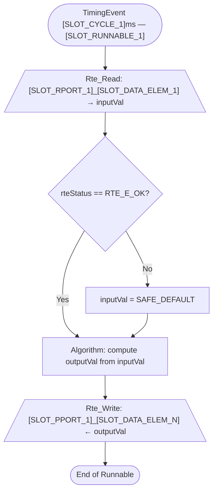
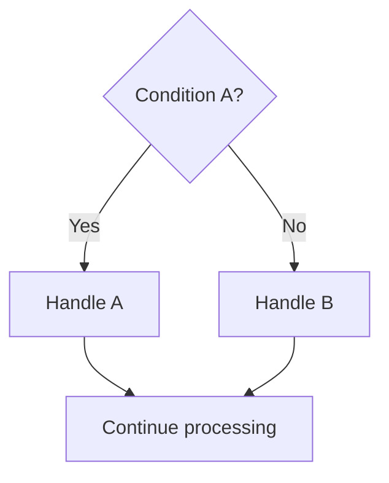

# AUTOSAR MUD Skill — CORE (Active Execution Instructions)

> **For the AI model:** Read this CORE file completely before generating any output.
> Only consult `MUD_SKILL_APPENDIX.md` for deep AUTOSAR concept definitions,
> naming keyword lookup, or extended examples. The CORE file contains all rules
> needed for execution.

---

## EXECUTION ORDER — FOLLOW THIS SEQUENCE EVERY TIME

```
STEP 0  → Ambiguity Resolution      (always run first)
STEP 1  → Pattern Selection         (match to Pattern Library)
STEP 2  → Fill Slots                (complete all SLOT markers)
STEP 3  → Generate Derived Model    (structured table output)
STEP 4  → Generate Pseudocode       (use pattern template, fill slots)
STEP 5  → Generate Mermaid          (follow Mermaid Algorithm exactly)
STEP 6  → Self-Check                (output the full checklist table)
```

**NEVER skip a step. NEVER reorder steps.**

---

## STEP 0 — AMBIGUITY RESOLUTION PROTOCOL

Run this before anything else. Count how many of the 5 Key Facts are present in the requirement.

### The 5 Key Facts

| # | Key Fact | Example of "present" | Example of "absent" |
|---|---------|---------------------|---------------------|
| K1 | Component function | "monitors battery voltage" | "some kind of monitor" |
| K2 | At least one input signal | "reads EngN from port" | no input mentioned |
| K3 | At least one output signal | "provides filtered voltage" | no output mentioned |
| K4 | Trigger / cycle time | "every 10ms", "on new data" | no timing given |
| K5 | Data units or types | "voltage in V", "speed in rpm" | no units, no types |

### Resolution Rules

**IF all 5 Key Facts present → proceed to STEP 1 immediately.**

**IF 3–4 Key Facts present → apply Default Assumption Table, flag every assumption:**
```
[ASSUMPTION: <Key Fact> not specified → using default: <value>. Correct if wrong.]
```

**IF fewer than 3 Key Facts present → output EXACTLY these 3 questions, then STOP:**
```
REQUIREMENTS NEEDED — Please answer these 3 questions:
Q1. What is the primary function? (e.g., "monitor battery", "limit motor torque")
Q2. What signals does this component read, and what provides them?
Q3. What signals does this component output, and what consumes them?
```
> Do NOT proceed to pattern selection until the user answers. Do NOT guess blindly.

### Default Assumption Table (use when Key Fact is absent, flag with [ASSUMPTION])

| Missing Key Fact | Default Applied |
|-----------------|----------------|
| K4: Cycle time | 10 ms TimingEvent |
| K4: Trigger type | TimingEvent (cyclic) |
| K5: Raw input data type | `uint16` (ADC counts) |
| K5: Processed output type | `float32` (physical unit) |
| K5: Status/flag type | `boolean` |
| K5: Enumerated state type | `uint8` |
| Component type | `AtomicSwComponentType` |
| Communication mode | Explicit (`Rte_Read` / `Rte_Write`) |
| Safety level | QM |
| Filter algorithm (if "filter" mentioned) | Moving average, 8 samples |
| Threshold (if "warning" / "limit" mentioned) | `float32`, calibratable via CalPrm |
| Port direction for "reads X" | R-Port, Sender-Receiver |
| Port direction for "provides Y / outputs Y" | P-Port, Sender-Receiver |
| Port direction for "calls service X" | R-Port, Client-Server |

---

## STEP 1 — PATTERN SELECTION

Read the requirement. Match it to exactly ONE pattern from the list below.
If two patterns seem to apply, choose the one whose TRIGGER KEYWORDS match most.

### Pattern Matching Table

| Pattern ID | Match When Requirement Contains... |
|-----------|-----------------------------------|
| `PAT_CYCLIC_SR` | "reads X", "provides Y", "every Nms" — single rate, no filter, no state |
| `PAT_FILTER` | "filter", "average", "smooth", "low-pass", "moving average" |
| `PAT_MULTI_RATE` | two different cycle times, "fast sampling", "1ms read + 10ms process" |
| `PAT_CS_CLIENT` | "calls a service", "requests from", "uses NvM", "NvM block", "Dem event" |
| `PAT_NVM_STATEFUL` | "persistent", "across power cycle", "NvM", "remember", "stored value" |
| `PAT_EVENT_DRIVEN` | "when X arrives", "on new data", "triggered by signal", "event-driven" |

**If no pattern matches clearly → use `PAT_CYCLIC_SR` as fallback and flag:**
```
[ASSUMPTION: No clear pattern match — using PAT_CYCLIC_SR as base. Adjust if needed.]
```

---

## STEP 2 — SLOT FILLING RULES

Every template below contains SLOT markers: `[SLOT_N: rule]`.
**Replace every SLOT marker with a concrete value derived from the requirement.**
**Never leave a SLOT unfilled in the output.**

### Universal Slot Rules (apply to all patterns)

| Slot | Rule | Good Example | Bad Example |
|------|------|-------------|-------------|
| `[SLOT_SWC_NAME]` | Noun compound, camelCase, no prefix, no domain tag | `BattMon`, `MtrCtrl` | `swc_Battery`, `t_Monitor` |
| `[SLOT_SWC_LONGNAME]` | Human-readable, first word capitalised, ≤80 chars | `Battery monitor` | `BATTERY_MONITOR` |
| `[SLOT_RPORT_N]` | Reflects what is REQUIRED; matches data meaning | `BattU`, `EngN` | `Input1`, `rPort_Speed` |
| `[SLOT_PPORT_N]` | Reflects what is PROVIDED; matches data meaning | `BattFiltV`, `TqReq` | `Output1`, `pPort_Out` |
| `[SLOT_IFACE_N]` | Same as data concept + sequence number suffix | `BattU1`, `EngN1` | `BattInterface`, `SRIface` |
| `[SLOT_DATA_ELEM_N]` | `Val` for generic scalar; descriptive for others | `Val`, `St`, `Req`, `Fbk` | `Data`, `value`, `output` |
| `[SLOT_IMPL_TYPE_N]` | AUTOSAR primitive | `uint16`, `float32`, `boolean`, `sint16` | `int`, `double`, `BOOL` |
| `[SLOT_RUNNABLE_N]` | `<SwcName>_Init`, `<SwcName>_<Nms>`, `<SwcName>_On<Event>` | `BattMon_100ms` | `Runnable1`, `run_batt` |
| `[SLOT_CYCLE_N]` | Period in ms | `10`, `100` | `fast`, `10ms` (no unit in code) |
| `[SLOT_SAFE_DEFAULT_N]` | Compile-time constant for error fallback | `0U`, `0.0f`, `FALSE` | no default |
| `[SLOT_EA_N]` | `EA_<ProtectedResource>` | `EA_FilterState` | `ExArea1` |
| `[SLOT_IRV_N]` | Descriptive noun, camelCase | `RawSample`, `FiltState` | `irv1`, `SharedData` |

---

## STEP 3 — DERIVED AUTOSAR MODEL OUTPUT FORMAT

Always output this exact structure first, before any code:

```
### Derived AUTOSAR Model

**Component:** [SLOT_SWC_NAME] (AtomicSwComponentType | SensorActuatorSwComponentType)
Long name: [SLOT_SWC_LONGNAME]

#### Port Table
| Port ShortName | Direction | Interface ShortName | Interface Type | Data Element | Impl. Type | Notes |
|---------------|-----------|--------------------|--------------  |-------------|-----------|-------|
| [SLOT_RPORT_1] | R-Port | [SLOT_IFACE_1] | Sender-Receiver | [SLOT_DATA_ELEM_1] | [SLOT_IMPL_TYPE_1] | ... |
| [SLOT_PPORT_1] | P-Port | [SLOT_IFACE_N] | Sender-Receiver | [SLOT_DATA_ELEM_N] | [SLOT_IMPL_TYPE_N] | ... |

#### Runnable Table
| Runnable ShortName | RTE Event | Cycle/Condition | Ports Read | Ports Written |
|-------------------|-----------|----------------|------------|--------------|
| [SLOT_RUNNABLE_1] | TimingEvent | [SLOT_CYCLE_1] ms | [list] | [list] |

#### IRV and ExclusiveArea (if applicable)
| Name | Type | Shared Between | Protection |
|------|------|---------------|-----------|
| [SLOT_IRV_1] | [type] | [runnable_a] ↔ [runnable_b] | [SLOT_EA_1] |

#### Assumptions Made
[List all [ASSUMPTION] tags here, or write "None — all Key Facts present."]
```

---

## STEP 4 — PATTERN TEMPLATES WITH FILLED SLOTS

### PAT_CYCLIC_SR — Cyclic, Single Rate, Sender-Receiver

```c
/**
 * @brief   Runnable: [SLOT_RUNNABLE_1]
 * @trigger TimingEvent, period = [SLOT_CYCLE_1] ms
 * @swc     [SLOT_SWC_NAME] (AtomicSwComponentType)
 * @ports   R: [SLOT_RPORT_1] ([SLOT_IFACE_1], Sender-Receiver, Explicit)
 *          P: [SLOT_PPORT_1] ([SLOT_IFACE_N], Sender-Receiver, Explicit)
 * @safety  QM  [OR: ASIL-B — add range checks and safe defaults if ASIL]
 */
void [SLOT_RUNNABLE_1](void)
{
    /* ── 1. Local Variables ──────────────────────────────────── */
    Std_ReturnType   rteStatus;
    [SLOT_IMPL_TYPE_1] inputVal;
    [SLOT_IMPL_TYPE_N] outputVal;

    /* ── 2. Read Input(s) ────────────────────────────────────── */
    rteStatus = Rte_Read_[SLOT_RPORT_1]_[SLOT_DATA_ELEM_1](&inputVal);
    if (rteStatus != RTE_E_OK)
    {
        /* [ASSUMPTION implied: safe default on read failure] */
        inputVal = [SLOT_SAFE_DEFAULT_1]; /* Safe default */
    }

    /* ── 3. Algorithm ────────────────────────────────────────── */
    /* TODO: Replace with actual computation from requirement */
    outputVal = ([SLOT_IMPL_TYPE_N])inputVal;

    /* ── 4. Write Output(s) ──────────────────────────────────── */
    (void)Rte_Write_[SLOT_PPORT_1]_[SLOT_DATA_ELEM_N](&outputVal);
}
```

---

### PAT_FILTER — Cyclic with Moving Average Filter

```c
/**
 * @brief   Runnable: [SLOT_RUNNABLE_1]
 * @trigger TimingEvent, period = [SLOT_CYCLE_1] ms
 * @note    Moving average filter over [FILTER_SIZE] samples.
 *          [ASSUMPTION: FILTER_SIZE=8 if not specified]
 */

#define [SLOT_SWC_NAME]_FILTER_SIZE     (8U)
#define [SLOT_SWC_NAME]_CONV_FACTOR     (0.01f) /* [SLOT_SAFE_DEFAULT_1]: Replace with actual CompuMethod LINEAR factor */
#define [SLOT_SWC_NAME]_WARN_THRESHOLD  (0.0f)  /* Replace with actual threshold value */
#define [SLOT_SWC_NAME]_RAW_SAFE        (0U)    /* Safe default for read failure */

void [SLOT_RUNNABLE_1](void)
{
    /* ── 1. Local Variables ──────────────────────────────────── */
    Std_ReturnType   rteStatus;
    [SLOT_IMPL_TYPE_1]  rawVal;
    float32             physVal;
    static float32      filterBuf[[SLOT_SWC_NAME]_FILTER_SIZE] = {0.0f};
    static uint8        bufIdx = 0U;
    float32             avgVal = 0.0f;
    boolean             warnActive;
    uint8               i;

    /* ── 2. Read Raw Input ───────────────────────────────────── */
    rteStatus = Rte_Read_[SLOT_RPORT_1]_[SLOT_DATA_ELEM_1](&rawVal);
    if (rteStatus != RTE_E_OK)
    {
        rawVal = [SLOT_SWC_NAME]_RAW_SAFE;
    }

    /* ── 3. Physical Conversion (CompuMethod LINEAR) ─────────── */
    physVal = (float32)rawVal * [SLOT_SWC_NAME]_CONV_FACTOR;

    /* ── 4. Moving Average Filter ────────────────────────────── */
    filterBuf[bufIdx] = physVal;
    bufIdx = (uint8)((bufIdx + 1U) % [SLOT_SWC_NAME]_FILTER_SIZE);
    for (i = 0U; i < [SLOT_SWC_NAME]_FILTER_SIZE; i++)
    {
        avgVal += filterBuf[i];
    }
    avgVal /= (float32)[SLOT_SWC_NAME]_FILTER_SIZE;

    /* ── 5. Threshold Logic (if requirement has warning/limit) ─ */
    warnActive = (avgVal < [SLOT_SWC_NAME]_WARN_THRESHOLD) ? TRUE : FALSE;

    /* ── 6. Write Outputs ────────────────────────────────────── */
    (void)Rte_Write_[SLOT_PPORT_1]_[SLOT_DATA_ELEM_1](&avgVal);
    (void)Rte_Write_[SLOT_PPORT_2]_St(&warnActive); /* Remove if no warning output */
}
```

---

### PAT_MULTI_RATE — Fast Acquisition + Slow Processing with IRV

Produces THREE runnables: Init, Fast (Nms), Slow (Mms).

```c
/* ── INIT RUNNABLE ───────────────────────────────────────────── */
/**
 * @brief   Runnable: [SLOT_SWC_NAME]_Init
 * @trigger InitEvent — runs once at ECU startup before cyclic runnables
 */
void [SLOT_SWC_NAME]_Init(void)
{
    [SLOT_IRV_TYPE] initSample = {0}; /* Zero-init IRV struct */
    Rte_IrvWrite_[SLOT_SWC_NAME]_Init_[SLOT_IRV_1](&initSample);

    [SLOT_IMPL_TYPE_N] outInit = ([SLOT_IMPL_TYPE_N])0;
    (void)Rte_Write_[SLOT_PPORT_1]_[SLOT_DATA_ELEM_N](&outInit);
}

/* ── FAST RUNNABLE: [SLOT_CYCLE_FAST]ms — raw data acquisition ── */
/**
 * @brief   Runnable: [SLOT_RUNNABLE_FAST]
 * @trigger TimingEvent, period = [SLOT_CYCLE_FAST] ms
 * @note    Reads raw input, stores in IRV for slow runnable.
 *          ExclusiveArea [SLOT_EA_1] protects IRV from preemption.
 */
void [SLOT_RUNNABLE_FAST](void)
{
    Std_ReturnType rteStatus;
    [SLOT_IRV_TYPE]   sample;

    rteStatus = Rte_Read_[SLOT_RPORT_1]_[SLOT_DATA_ELEM_1](&sample.field1);
    if (rteStatus != RTE_E_OK) { sample.field1 = [SLOT_SAFE_DEFAULT_1]; }

    /* Optional second port read */
    rteStatus = Rte_Read_[SLOT_RPORT_2]_[SLOT_DATA_ELEM_2](&sample.field2);
    if (rteStatus != RTE_E_OK) { sample.field2 = [SLOT_SAFE_DEFAULT_2]; }

    Rte_Enter_[SLOT_EA_1]();
    Rte_IrvWrite_[SLOT_RUNNABLE_FAST]_[SLOT_IRV_1](&sample);
    Rte_Exit_[SLOT_EA_1]();
}

/* ── SLOW RUNNABLE: [SLOT_CYCLE_SLOW]ms — processing ─────────── */
/**
 * @brief   Runnable: [SLOT_RUNNABLE_SLOW]
 * @trigger TimingEvent, period = [SLOT_CYCLE_SLOW] ms
 * @note    Reads IRV snapshot, runs algorithm, writes outputs.
 */
void [SLOT_RUNNABLE_SLOW](void)
{
    [SLOT_IRV_TYPE]    sample;
    [SLOT_IMPL_TYPE_N] result;

    /* Read IRV snapshot (protected) */
    Rte_Enter_[SLOT_EA_1]();
    sample = Rte_IrvRead_[SLOT_RUNNABLE_SLOW]_[SLOT_IRV_1]();
    Rte_Exit_[SLOT_EA_1]();

    /* Algorithm — replace with actual computation */
    result = ([SLOT_IMPL_TYPE_N])sample.field1; /* TODO: implement logic */

    (void)Rte_Write_[SLOT_PPORT_1]_[SLOT_DATA_ELEM_N](&result);
}
```

---

### PAT_CS_CLIENT — Runnable Calling a Client-Server Operation

```c
/**
 * @brief   Runnable: [SLOT_RUNNABLE_1]
 * @trigger TimingEvent, period = [SLOT_CYCLE_1] ms
 * @note    Uses C/S R-Port [SLOT_RPORT_CS] to call [SLOT_OP_NAME].
 */
void [SLOT_RUNNABLE_1](void)
{
    Std_ReturnType   rteStatus;
    [SLOT_IMPL_TYPE_1] inputVal;
    [SLOT_IMPL_TYPE_N] serviceResult;

    /* ── 1. Read Input ───────────────────────────────────────── */
    rteStatus = Rte_Read_[SLOT_RPORT_1]_[SLOT_DATA_ELEM_1](&inputVal);
    if (rteStatus != RTE_E_OK) { inputVal = [SLOT_SAFE_DEFAULT_1]; }

    /* ── 2. Call Server Operation ────────────────────────────── */
    rteStatus = Rte_Call_[SLOT_RPORT_CS]_[SLOT_OP_NAME](inputVal, &serviceResult);
    if (rteStatus != RTE_E_OK)
    {
        serviceResult = [SLOT_SAFE_DEFAULT_N]; /* Service unavailable — use fallback */
    }

    /* ── 3. Process and Write ────────────────────────────────── */
    (void)Rte_Write_[SLOT_PPORT_1]_[SLOT_DATA_ELEM_N](&serviceResult);
}
```

---

### PAT_NVM_STATEFUL — Component with NvM Persistent State

Produces TWO runnables: Init (reads NvM), Cyclic (processes + writes NvM periodically).

```c
/* ── INIT RUNNABLE ───────────────────────────────────────────── */
/**
 * @brief   Runnable: [SLOT_SWC_NAME]_Init
 * @trigger InitEvent
 * @note    Reads NvM mirror into static variable. Falls back to factory default.
 */
void [SLOT_SWC_NAME]_Init(void)
{
    Std_ReturnType     rteStatus;
    [SLOT_NVM_TYPE]    nvValue;

    rteStatus = Rte_Read_[SLOT_RPORT_NVM]_[SLOT_DATA_ELEM_NVM](&nvValue);
    if (rteStatus == RTE_E_OK)
    {
        [SLOT_STATIC_VAR] = nvValue;
    }
    else
    {
        [SLOT_STATIC_VAR] = [SLOT_FACTORY_DEFAULT]; /* [ASSUMPTION: factory default] */
    }
}

/* ── CYCLIC RUNNABLE ─────────────────────────────────────────── */
/**
 * @brief   Runnable: [SLOT_RUNNABLE_1]
 * @trigger TimingEvent, period = [SLOT_CYCLE_1] ms
 */
static [SLOT_NVM_TYPE] [SLOT_STATIC_VAR] = [SLOT_FACTORY_DEFAULT]; /* Module-level state */

void [SLOT_RUNNABLE_1](void)
{
    Std_ReturnType   rteStatus;
    [SLOT_IMPL_TYPE_1] inputVal;

    rteStatus = Rte_Read_[SLOT_RPORT_1]_[SLOT_DATA_ELEM_1](&inputVal);
    if (rteStatus != RTE_E_OK) { inputVal = [SLOT_SAFE_DEFAULT_1]; }

    /* Update persistent state */
    [SLOT_STATIC_VAR] = ([SLOT_NVM_TYPE])inputVal; /* TODO: actual update logic */

    /* Write back to NvM mirror (triggers NvM WriteAll on next NvM cycle) */
    (void)Rte_Write_[SLOT_PPORT_NVM]_[SLOT_DATA_ELEM_NVM](&[SLOT_STATIC_VAR]);

    /* Write operational output */
    (void)Rte_Write_[SLOT_PPORT_1]_[SLOT_DATA_ELEM_N](&[SLOT_STATIC_VAR]);
}
```

---

### PAT_EVENT_DRIVEN — DataReceivedEvent Triggered Runnable

```c
/**
 * @brief   Runnable: [SLOT_SWC_NAME]_On[SLOT_RPORT_1]
 * @trigger DataReceivedEvent on R-Port [SLOT_RPORT_1], element [SLOT_DATA_ELEM_1]
 * @note    Triggered when new data arrives — NOT cyclic.
 */
void [SLOT_SWC_NAME]_On[SLOT_RPORT_1](void)
{
    Std_ReturnType     rteStatus;
    [SLOT_IMPL_TYPE_1] receivedData;
    [SLOT_IMPL_TYPE_N] result;

    /* ── 1. Read Triggering Data ─────────────────────────────── */
    rteStatus = Rte_Read_[SLOT_RPORT_1]_[SLOT_DATA_ELEM_1](&receivedData);
    if (rteStatus != RTE_E_OK)
    {
        return; /* Abort — error handled by DataReceiveErrorEvent runnable */
    }

    /* ── 2. Validate Range ───────────────────────────────────── */
    if ((receivedData < [SLOT_SWC_NAME]_DATA_MIN) ||
        (receivedData > [SLOT_SWC_NAME]_DATA_MAX))
    {
        receivedData = [SLOT_SAFE_DEFAULT_1]; /* Clamp to safe default */
    }

    /* ── 3. Process ──────────────────────────────────────────── */
    result = ([SLOT_IMPL_TYPE_N])receivedData; /* TODO: implement logic */

    /* ── 4. Write Output ─────────────────────────────────────── */
    (void)Rte_Write_[SLOT_PPORT_1]_[SLOT_DATA_ELEM_N](&result);
}
```

---

## STEP 5 — MERMAID GENERATION ALGORITHM

**Execute these rules in order. Do NOT deviate.**

### Rule M1 — File Header
Always start with exactly:
```
graph TD
```

### Rule M2 — Node ID Rules
- Node IDs: letters and digits ONLY. No spaces. No underscores. No special chars.
- Good: `ReadBattU`, `CheckRte`, `WriteOutput`, `Start`, `End`
- Bad: `Read_BattU`, `Check-Rte`, `Write Output`, `node 1`

### Rule M3 — Node Shape by Purpose

| Purpose | Mermaid Syntax | Example |
|---------|---------------|---------|
| Entry point (RTE event) | `Start(["TimingEvent Nms — RunnableName"])` | `Start(["TimingEvent 10ms — BattMon_100ms"])` |
| Process step | `Step["Description of action"]` | `Convert["physVal = rawVal × 0.01"]` |
| Decision / branch | `Check{"Condition?"}` | `Check{"rteStatus == RTE_E_OK?"}` |
| RTE Read (I/O) | `ReadX[/"Rte_Read: PortName_Elem → varName"\]` | `ReadBatt[/"Rte_Read: BattU_Val → rawAdc"\]` |
| RTE Write (I/O) | `WriteX[/"Rte_Write: PortName_Elem ← varName"\]` | `WriteV[/"Rte_Write: BattFiltV_Val ← avgVal"\]` |
| End point | `End(["End of Runnable"])` | same |

### Rule M4 — Edge Rules
- Standard edge: `NodeA --> NodeB`
- Labelled edge (always use on decision branches): `NodeA -->|"Yes"| NodeB`
- Edge labels MUST be in double quotes: `|"Yes"|` not `|Yes|`

### Rule M5 — Decision Diamond Rules
- Every `{...}` diamond node MUST have EXACTLY 2 outgoing edges.
- Label them `|"Yes"|` and `|"No"|` OR `|"OK"|` and `|"Error"|` as appropriate.
- NEVER leave a decision with only 1 outgoing edge.

### Rule M6 — Maximum Complexity
- Maximum 15 nodes per diagram.
- If runnable has more than 15 logical steps → group steps into combined nodes.

### Rule M7 — Label Content Rules
- Labels MUST NOT contain: `<`, `>`, `(`, `)`, `;`, `{`, `}`, `[`, `]` (inside label text)
- Labels MUST NOT contain raw C code with operators — describe in plain English
- Good: `"Convert raw ADC to voltage using LINEAR factor"`
- Bad: `"voltage = (float32)rawAdc * 0.01f;"`

### Rule M8 — Structural Template (copy and adapt for every runnable)



### Rule M9 — Multi-Decision Merge Pattern (use when multiple checks exist)


### Rule M10 — Syntax Verification (mental check before outputting)
Before writing the Mermaid block, verify:
1. Every node ID used on right side of `-->` is also defined as a node somewhere.
2. Every `{diamond}` has exactly 2 outgoing `-->` edges.
3. No node ID contains spaces or special characters.
4. All edge labels are in `|"..."| ` double quotes.
5. Diagram ends at `End(["End of Runnable"])`.

---

## STEP 6 — MANDATORY SELF-CHECK OUTPUT

**After generating pseudocode and flowchart, output this exact table.**
Fill each Result cell with ✅ (pass) or ❌ (fail) and a brief note.
If any row is ❌, output a corrected version below the table.

```markdown
### MUD Self-Check Results

| # | Check | Result | Note |
|---|-------|--------|------|
| 1 | All SLOT markers replaced (none remaining in output) | ✅/❌ | |
| 2 | Component shortName: camelCase noun, no prefix, no underscore | ✅/❌ | |
| 3 | All interface shortNames end with a sequence number (e.g., BattU1) | ✅/❌ | |
| 4 | Every Rte_Read return stored in Std_ReturnType and checked | ✅/❌ | |
| 5 | Every error/invalid path has a safe default value assigned | ✅/❌ | |
| 6 | No undefined macro or constant used (all #define present or labelled TODO) | ✅/❌ | |
| 7 | All static variables declared static at module scope | ✅/❌ | |
| 8 | Mermaid: no node ID contains spaces or special chars | ✅/❌ | |
| 9 | Mermaid: every diamond has exactly 2 outgoing labelled edges | ✅/❌ | |
| 10 | All [ASSUMPTION] tags listed in Derived Model Assumptions section | ✅/❌ | |

**Overall:** [PASS — all ✅] or [NEEDS CORRECTION — see below]
```

---

## APPENDIX REFERENCE GUIDE

Load `MUD_SKILL_APPENDIX.md` ONLY when you need:

| Need | Appendix Section |
|------|-----------------|
| Full AUTOSAR element definitions | §A1 — AUTOSAR Concepts |
| Naming keyword abbreviations (e.g., "how to abbreviate Acceleration") | §A2 — Keyword Cheat Sheet |
| CompuMethod / DataConstr / PhysicalDimension rules | §A3 — Data Type Deep Dive |
| ISO 26262 ASIL-B detailed checklist | §A4 — Safety Checklist |
| Anti-pattern reference | §A5 — Anti-Patterns |
| Full BattMon worked example | §A6 — Example 1 |
| Full MtrIdqLimiter worked example | §A7 — Example 2 |
| RTE error code definitions | §A8 — RTE API Reference |

**Do NOT load the APPENDIX for routine requirements — the CORE has everything needed.**
